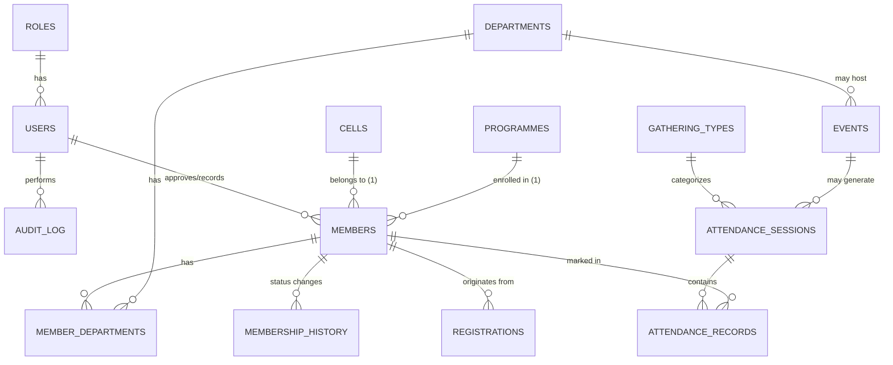

# PENSA GCTU Church Management System — System Design

**Status:** Approved (design) · **Date:** 2026-06-04
**Repository:** Dennisetornam/PENSA-GCTU-church-management-system
**Audit note:** Repository was empty at design time — this is a greenfield build; debt/security/scalability are designed against, not remediated.

---

## 1. Product Scope

| Decision | Value |
|---|---|
| Tenancy | Single church (PENSA GCTU). No multi-tenancy. |
| v1 Modules | Member Directory, Attendance, Events & Groups (Departments + Cells), Public Registration + Approval, Analytics |
| Deferred (v2+) | Giving/donations, member self-service logins, communications/SMS |
| Users | Staff/admins only — role-based. No public accounts (registration is a public form, not an account). |
| Hosting | Cloudflare (Workers + D1 + R2 + KV) |
| Bar | Production-grade, secure, scalable |

### Design principles for growth-without-redesign
- Lookup tables (departments, cells, gathering types, programmes) instead of hardcoded enums — grow by adding rows.
- Membership status is a recorded lifecycle, not a flag (history table).
- Attendance engine is gathering-driven and event-extensible.
- RBAC is data-driven; new scoped roles (department/cell leader) activate without redesign.

---

## 2. Technology Stack

| Layer | Choice | Rationale |
|---|---|---|
| Runtime | Cloudflare Workers | Auto-scaling, global, zero server ops |
| Framework | React Router v7 (Remix), SSR | First-class Cloudflare support; server loaders/actions keep auth + data server-side |
| Language | TypeScript (strict) | Eliminates a class of runtime bugs |
| UI | Tailwind CSS + shadcn/ui | Accessible, polished admin dashboard |
| Database | Cloudflare D1 (serverless SQLite) | Right-sized; runs locally |
| ORM / migrations | Drizzle ORM | Type-safe schema + versioned migrations |
| Media | Cloudflare R2 | Profile pictures / event images off the DB |
| Sessions & rate-limit | Cloudflare KV | Fast, global |
| Auth | Session-cookie auth; WebCrypto (PBKDF2/scrypt) hashing | Workers-compatible; no heavy deps |
| Validation | Zod | One schema validates input + types |
| Email | Resend (via Worker fetch) | Reliable outbound |
| Testing | Vitest + @cloudflare/vitest-pool-workers; Playwright E2E | Tests run in the real Workers runtime |
| CI/CD | GitHub Actions → Wrangler | Typecheck/lint/test → deploy |

---

## 3. Folder Structure

```
PENSA-GCTU-church-management-system/
├─ app/                        # React Router (Remix) application
│  ├─ routes/                  # Route modules (loaders/actions = server)
│  ├─ components/              # Presentational UI (no business logic)
│  ├─ features/               # members/ groups/ events/ attendance/ registration/ analytics/
│  ├─ lib/                     # auth, rbac, db client, validation, utils
│  └─ root.tsx
├─ db/
│  ├─ schema/                  # Drizzle table definitions
│  ├─ migrations/              # Generated SQL migrations
│  └─ seed.ts
├─ workers/                    # Worker entry + bindings
├─ tests/                      # unit + integration + e2e
├─ .github/workflows/          # ci.yml, deploy.yml
├─ wrangler.toml               # D1/R2/KV bindings per env
├─ drizzle.config.ts
└─ docs/                       # architecture, runbooks, ADRs
```

Principle: routes thin (auth + call service) · features hold business logic · components are dumb UI.

---

## 4. Entity Relationship Diagram



**Relationships:** Member→Cell (M:1) · Member↔Department (M:N) · Member→Programme (M:1) · Member→MembershipHistory (1:N) · Registration→Member (1:1) · GatheringType→AttendanceSession (1:N) · AttendanceSession↔Member (M:N via attendance_records) · Role→User (1:N) · User→AuditLog (1:N).

---

## 5. Database Schema

### Lookups (seeded, extensible)
- **cells:** Dunamis, Moriah, Peniel
- **departments:** Media, Music & Drama, Prayer, Organizing, Bible Studies
- **gathering_types:** Sunday Service, Midweek Service, Adullam, Prayer Fest, Outreach
- **programmes:** managed dropdown, seeded from GCTU programme list (provided later)

### members
| Column | Type | Constraints |
|---|---|---|
| id | text (uuid) | PK |
| first_name | text | not null |
| last_name | text | not null |
| other_names | text | null |
| date_of_birth | date | null |
| gender | text | null (recommended) |
| profile_picture_key | text | null (R2 key) |
| programme_id | fk → programmes | null |
| residence_status | text | enum: hostel_resident \| non_resident |
| residence_during_vacation | text | null |
| cell_id | fk → cells | null |
| holy_ghost_baptism | boolean | default false |
| holy_ghost_baptism_date | date | null |
| water_baptism | boolean | default false |
| water_baptism_date | date | null |
| phone_number | text | not null |
| whatsapp_number | text | null |
| membership_status | text | enum: actual_member \| visitor \| associate \| alumni |
| registration_status | text | enum: pending \| approved \| rejected |
| approved_by | fk → users | null |
| approved_at | datetime | null |
| join_date | date | null |
| notes | text | null |
| created_at / updated_at | datetime | UTC |

Indexes: membership_status, registration_status, cell_id, programme_id, last_name.

### member_departments (M:N)
member_id (fk), department_id (fk), role_in_department, joined_at · unique(member_id, department_id).

### membership_history
id, member_id (fk), from_status, to_status, changed_by (fk users), reason, created_at.

### registrations
id, payload (json snapshot), status (pending|approved|rejected), submitted_at, reviewed_by (fk), reviewed_at, member_id (fk, null until approved), rejection_reason.

### Lookups detail
- **cells:** id, name, leader_member_id?, description, is_active
- **departments:** id, name, leader_member_id?, description, is_active
- **programmes:** id, name, level?, is_active
- **gathering_types:** id, name, cadence (weekly|periodic|special), is_active

### attendance_sessions
id, gathering_type_id (fk), event_id (fk, null), title, session_date, status (open|closed), recorded_by (fk), created_at · index (gathering_type_id, session_date).

### attendance_records
id, session_id (fk), member_id (fk), status (present|absent|excused), checked_in_at · unique(session_id, member_id) · index member_id.

### events
id, title, description, location, starts_at, ends_at, department_id (fk, null), gathering_type_id (fk, null), created_by, created_at.

### Identity & audit
- **roles:** id, name, description, is_system
- **users:** id, full_name, email (unique), password_hash, role_id (fk), status (active|suspended), last_login_at, created_at
- **sessions:** in KV (session_id → {user_id, role, exp}); idle + absolute expiry
- **audit_log:** id, user_id (fk), action, entity, entity_id, metadata(json), ip, created_at

---

## 6. API Architecture

Remix loaders (reads) + actions (writes) are primary; resource routes expose JSON for future integrations. Every endpoint: **authenticate → authorize (RBAC) → validate (Zod) → service → audit**.

| Domain | Endpoint | Methods | Min role |
|---|---|---|---|
| Auth | /login, /logout, /me | POST/GET | public / self |
| Registration (public) | /register | GET, POST | public (no auth) |
| Approvals | /registrations, /registrations/:id/approve, /reject | GET, POST | staff/admin |
| Members | /members, /members/:id | GET/POST/PATCH/DELETE | staff (R/W), admin (delete) |
| Member media | /members/:id/photo | POST (→ R2) | staff |
| Departments | /departments, /departments/:id | GET/POST/PATCH | admin |
| Cells | /cells, /cells/:id | GET/POST/PATCH | admin |
| Programmes | /programmes, /programmes/:id | GET/POST/PATCH | admin |
| Events | /events, /events/:id | GET/POST/PATCH/DELETE | staff |
| Attendance | /attendance/sessions, /sessions/:id/records | GET/POST/PATCH | staff |
| Analytics | /analytics/* | GET | staff/admin |
| Users/Roles | /users, /roles | GET/POST/PATCH | super_admin |
| Audit | /audit | GET | super_admin |

Cross-cutting: pagination (?page&limit), list filtering/search, rate-limiting on /login and /register (KV), CSRF on mutations, standardized error envelope.

---

## 7. User Roles

| Role | Purpose | Scope |
|---|---|---|
| super_admin | System owner | Everything + users/roles + audit + settings |
| admin | Pastoral/exec leadership | Full member/attendance/events + lookups + approvals |
| staff | Ushers/secretaries | Members R/W, record attendance, registrations/approvals; no deletes; no user mgmt |
| department_leader (growth-ready) | Dept head | Read members; manage own department roster & attendance |
| cell_leader (growth-ready) | Cell shepherd | Read/attendance for own cell only |

v1 enforces super_admin/admin/staff; leader roles pre-modeled for later activation without redesign.

---

## 8. Permission Matrix

`✔ allowed · ▲ own-scope only · — denied`

| Resource : Action | super_admin | admin | staff | dept_leader | cell_leader |
|---|:--:|:--:|:--:|:--:|:--:|
| members : create | ✔ | ✔ | ✔ | — | — |
| members : read | ✔ | ✔ | ✔ | ▲ dept | ▲ cell |
| members : update | ✔ | ✔ | ✔ | ▲ | — |
| members : delete | ✔ | ✔ | — | — | — |
| registrations : review/approve | ✔ | ✔ | ✔ | — | — |
| attendance : record | ✔ | ✔ | ✔ | ▲ | ▲ |
| attendance : read | ✔ | ✔ | ✔ | ▲ | ▲ |
| events : manage | ✔ | ✔ | ✔ | ▲ | — |
| departments/cells/programmes : manage | ✔ | ✔ | — | — | — |
| analytics : view | ✔ | ✔ | ✔ | ▲ | ▲ |
| users/roles : manage | ✔ | — | — | — | — |
| audit_log : view | ✔ | — | — | — | — |

---

## 9. Application Flow

```
Login ─► Dashboard (KPIs)
          ├─ Members ──► list/search ─► profile ─► edit
          ├─ Registrations ──► pending queue ─► review ─► approve/reject
          ├─ Attendance ──► pick gathering+date ─► mark ─► close session
          ├─ Events ──► calendar/list ─► create/edit
          ├─ Groups ──► Departments / Cells ─► rosters
          ├─ Analytics ──► trends & breakdowns
          └─ Admin ──► Users · Roles · Lookups · Audit  (super_admin)
```
Public unauthenticated branch: /register → confirmation (feeds Registrations queue).

---

## 10. Registration Workflow

```
Public /register form
  ▼ fills: name, DOB, photo, programme, residence (+vacation),
           department(s), cell, baptism info, phone, WhatsApp
  ▼ Zod validation + rate-limit + dedupe (phone/name)
  ▼ create REGISTRATIONS row → status=pending, member_id=null
  ▼ confirmation screen ("Submitted, pending approval")
  ▼ appears in staff Pending Registrations queue
```
No member account is created (staff-only logins preserved). Photo → R2.

---

## 11. Approval Workflow

```
Staff opens Pending Registrations
  ▼ review ▸ may edit/normalize fields
  ▼ decision:
     APPROVE → create MEMBERS from payload
               registration_status=approved
               membership_status=visitor (default)
               approved_by, approved_at set
               membership_history (none→visitor)
               audit_log entry
     REJECT  → status=rejected, record rejection_reason
  ▼ member active in directory
  ▼ lifecycle: Visitor → Actual Member → Associate / Alumni
              (each transition writes membership_history + audit)
```

---

## 12. Attendance Workflow

```
Attendance ▸ New Session
  ▼ choose Gathering Type (Sunday/Midweek/Adullam/Prayer Fest/Outreach) + date
  ▼ session created (status=open), recorded_by set
  ▼ mark roster: search ▸ Present / Absent / Excused
       (filter by cell/department; bulk "mark all present")
  ▼ save records (unique per session+member) ▸ close session
  ▼ feeds analytics
```

---

## 13. Analytics Workflow

```
Sources: members · attendance_records · membership_history · lookups
  ▼ indexed/paginated aggregation (hot results cached in KV)
  ▼ dashboard widgets:
     • Membership growth by status
     • Attendance trend per gathering type
     • Attendance rate by Cell (Dunamis/Moriah/Peniel)
     • Department participation distribution
     • Baptism coverage (Holy Ghost / Water %)
     • Residence split (hostel vs non-resident)
     • Visitor → Actual Member conversion funnel
     • Retention / absentee watchlist (consecutive absences)
  ▼ filters: date range · gathering type · cell · department · status
  ▼ export: CSV / printable report
```

---

## 14. Deployment Architecture

```
GitHub (main)
   │ push / PR
   ▼
GitHub Actions ── CI: typecheck · lint · unit/integration tests
   │ on merge → main
   ▼
Wrangler deploy ──► Cloudflare Workers ──► D1 (database)
                                       ├─► R2 (media)
                                       └─► KV (sessions, rate-limit)
```
- Environments: local (wrangler dev + local D1) → staging (preview) → production, each with own bindings.
- Secrets: wrangler secret + GitHub Actions secrets (Resend key, session secret). Never committed.
- Migrations applied as a CD step before deploy.
- Custom domain via Cloudflare DNS + automatic TLS.
- Backups/DR: D1 Time Travel + scheduled exports to R2.
- Observability: Workers logs/analytics; structured logging; optional Sentry.

---

## 15. Security & Scalability Guardrails

**Security:** server-side authorization on every mutation · WebCrypto password hashing · HttpOnly/Secure/SameSite session cookies · CSRF defense · rate-limited auth + registration · Zod-validated inputs · audit logging · secrets in Wrangler/GitHub · least-privilege roles · security headers/CSP.

**Scalability:** stateless auto-scaling Workers · indexed + paginated queries (no N+1) · media in R2 (not DB) · KV-cached hot analytics · documented escape hatch to Hyperdrive + Postgres if D1 is outgrown (schema portable via Drizzle).

---

## 16. Implementation Roadmap (phases)

| Phase | Deliverable | Key items |
|---|---|---|
| 0 — Foundations | Deployable empty app | Scaffold, TS strict, Tailwind/shadcn, Wrangler + D1/R2/KV, CI, first staging deploy |
| 1 — Auth & RBAC | Secure login | users/roles/sessions, hashing, login/logout, RBAC middleware, audit log, seed super_admin |
| 2 — Lookups | Reference data | cells, departments, gathering_types, programmes (seed + admin CRUD) |
| 3 — Members | Directory | CRUD, search/filter/pagination, photo→R2, membership_history, soft-delete |
| 4 — Registration & Approval | Intake pipeline | public /register, pending queue, approve/reject → member |
| 5 — Groups | Departments & Cells | rosters, M:N assignment, leaders |
| 6 — Events | Calendar | CRUD, link to department/gathering |
| 7 — Attendance | Tracking | sessions per gathering, mark present/absent/excused, per-member history |
| 8 — Analytics | Dashboards | widgets, filters, CSV/print export |
| 9 — Hardening & Launch | Production | security headers/CSP, rate limiting, E2E tests, backups, docs/runbooks, production deploy + domain |

Each phase is independently shippable and built test-first.
